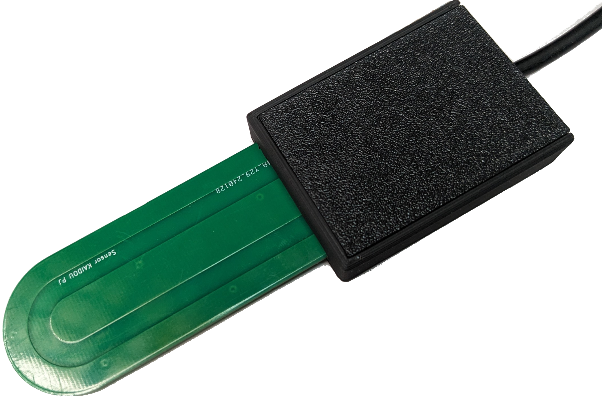
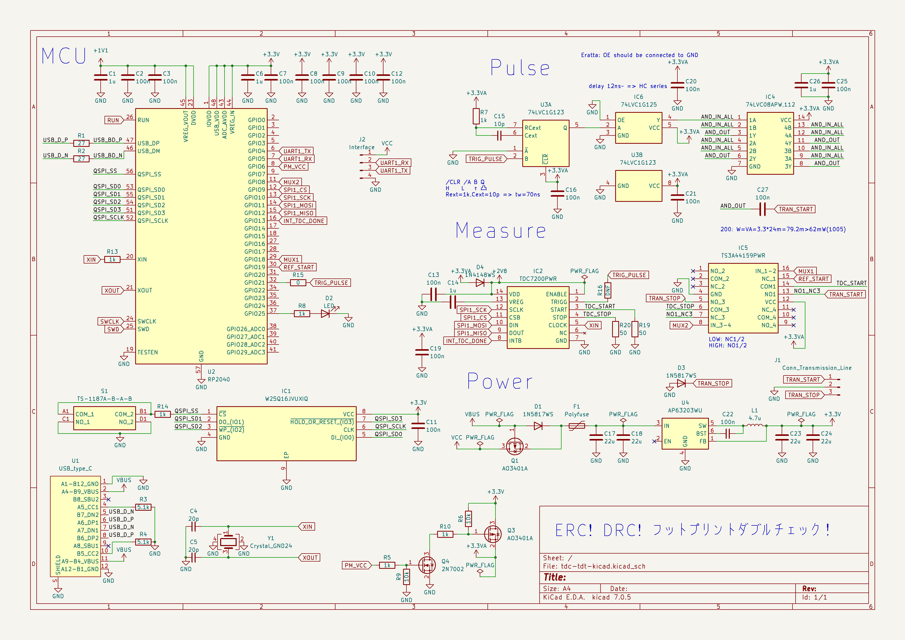
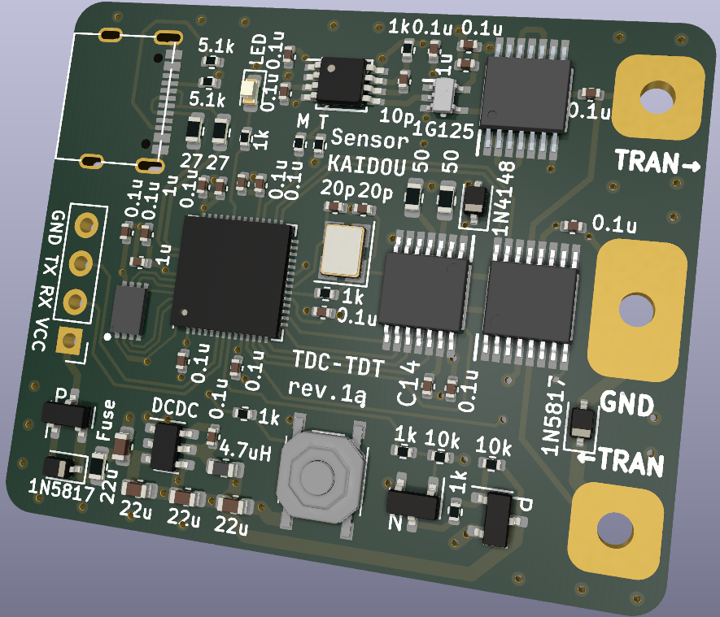
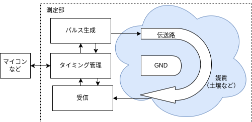

# mameTDT

**This is EXPERIMENTAL sensor for now.**

mameTDTは、TDT（Time Domain Transmissiometry）方式の誘電率センサーです。土の水分量や油の劣化度合いなど、用途に応じていろいろなものを測れます。

以下フォルダの製造ファイルをJLCPCBなどの基板製造・実装業者に入稿すると、実装済み基板が送られてきます。本体とプローブ（先端）は別ファイルなので、気をつけてください。

[本体の製造ファイルはこちら](./pcb/tdc-tdt-kicad/jlcpcb/production_files/)  
[プローブ（30x70mm）の製造ファイルはこちら](./pcb/tdc-tdt-kicad/probe/standard_garber.zip)

## 原理
伝送路上の電磁波の伝播速度$`v[m/s]`$は、$`v=c/\sqrt{\epsilon}`$（光速$`c[m/s]`$、比誘電率$\epsilon$）で与えられます。これを変形すると、$`\epsilon=(c/v)^2`$です。つまり、伝播速度$v$がわかれば比誘電率$`\epsilon`$がわかります。

また、$`速度[m/s]=距離[m]/時間[s]`$という関係から、距離が一定で、時間がわかれば、速度がわかります。

以上から、一定の長さの伝送路の片端に適当に電圧（ステップ波、パルス波など）を加えて、もう片端に達するまでの時間を測れば、伝播速度がわかり、そこから比誘電率もわかります。

ここでは、TDC（Time to Digital Converter）という微少時間測定ICを使って伝播時間を測っています。

## 応用例
- 土壌水分量センサー

土が水・空気・土そのものの混合物だと考えると、誘電率がわかれば、水分量を知ることができます。
多くの場合、誘電率と水分量の関係は、Toppの式と呼ばれる下式で表されます。  

$`\theta=−5.3 × 10^{−2}  + 2.92 × 10^{−2} \epsilon−5.5 × 10^{−4} \epsilon^2+ 4.3 × 10^{−6}\epsilon^3`$  
ただし、土の水分量$`\theta [m^3/m^3]`$、比誘電率$`\epsilon`$です。

## 回路
 
回路図
  
PCBの3Dレンダリング
  
ブロック図

- パルス生成部  
単安定マルチバイブレータICの74LVC1G123で一定幅のパルス波を作り、バッファICで受けます。バッファICの出力をロジックIC（AND回路）の74LVC08APWに入力し、出力を４並列にして、ごく短い立ち上がり時間のパルス波を伝送路に入力します。十分な帯域幅を持ったオシロスコープがないので、確認出来ていませんが、おそらく500psくらいの立ち上がり時間です。

- タイミング管理部・受信部  
TDC7200というTI製のTDC ICを用いています。これは、測定できる最小時間が12nsですが、マイコンから基準開始信号を入力して、その基準からの時間の差を測って、12nsよりも短い時間を測っています。TIのアプリケーションレポートSNAA288を参考にしました。

- 電源回路  
Diodes IncのDCDCコンバータを使っています。USBと外部電源が同時に入力された場合、電圧の高い方を優先します。なお、入力電圧範囲は、4.5V～30Vを推奨します。

- マイコン  
Raspberry Pi財団の作ったマイコンRP2040を使っています。USBでのファームウェア書き込みが容易なことと、PIOというプログラム可能入出力機能が実装上便利だったので、採用しました。

## 使い方

### プログラムの書き込み
1. ここからファームウェアをダウンロードする。  
    （必要があれば、"Getting Started With Raspberry Pi Pico"などを参考に環境構築し、ビルドしてください）
1. 基板上のボタンを押しながら、USBでコンピュータに接続する。
1. USBメモリと同じように、RPI-RP2というドライブが認識されるので、ファームウェアをドラッグアンドドロップする。
1. 完了

### インターフェイス
UARTとUSBに対応しています。ケースに入れる際は、UARTのみの対応です。基板上の印字に従って配線し、適当なシリアル変換器や対応デバイスに接続してご利用ください。

### コマンド
現状、ASCIIコードの't'が入力された際、生の測定値（最大周波数：50Hz程度）を返します。適宜ノイズ処理を行ってご利用ください。

### 校正
少なくとも4点程度での校正をおすすめします。現状、生の値とプローブ長から決まる真値からExcel等で多項式補完して校正曲線を求める方法をおすすめします。校正に使いやすい物質とその比誘電率は次の通りです。

| 物質                     | 比誘電率(温度) | 
| ------------------------ | -------------- | 
| 空気                     | 1              | 
| イソプロパノール         | 19.92(25)      | 
| エタノール70wt%・水30wt% | 39.14(20)      | 
| エタノール40wt%・水60wt% | 56.49(20)      | 
| 水                       | 78.55(25)      | 

## ToDo
- 自動校正機能（プログラム）
- SDI-12への対応（プログラム）

## License
Apache-2.0 License